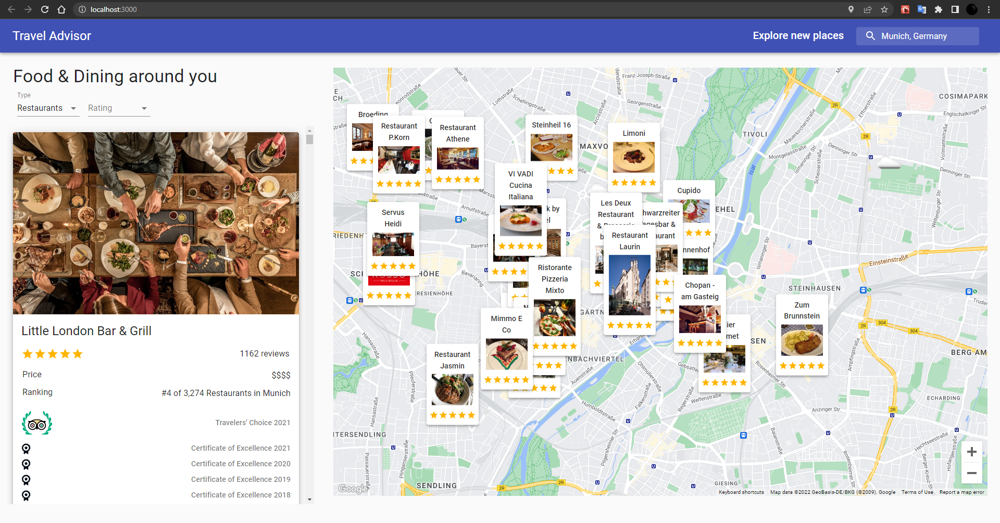
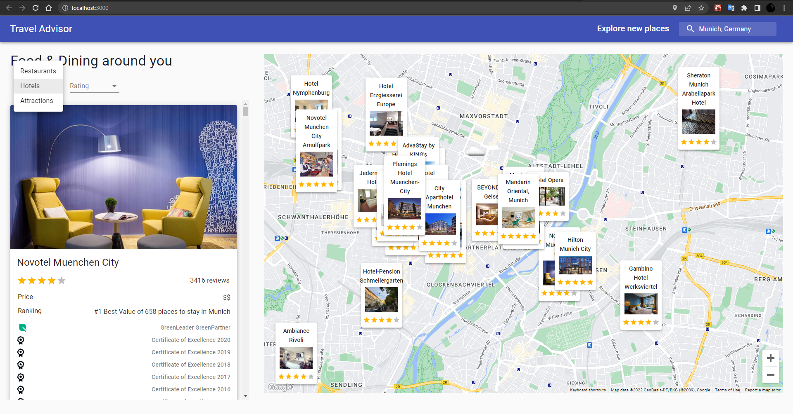
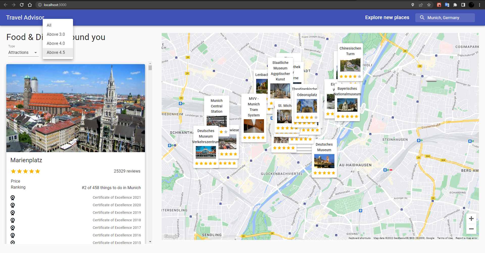

# Travel Advisor
<!-- ABOUT THE PROJECT -->
## About The Project

You can list the restaurants, hotels, and attractions in the country and city you want to go to, and you can reach their details and learn their location on the map and also the weather in that region with the Travel Advisor application. If you change the x-axis, y-axis, or zoom of the map, the application calculates the changed region boundary by latitude and longitude. It gives you the location of restaurants, hotels, or attractions inside of the computed map boundary.

!Important Note: You have to know there is a limited fetching request in the application because of the used free APIs.

### Project Images






### Built With

* [React.js](https://reactjs.org/)
* [Node.js](https://nodejs.org/en/)
* [Material UI](https://mui.com/)
* [Google Maps](https://developers.google.com/maps)
* [Rapid API](https://rapidapi.com)

<p align="right">(<a href="#top">back to top</a>)</p>

<!-- GETTING STARTED -->
## Getting Started

To get a local copy up and running follow these simple steps.

### Prerequisites

You need to install prerequisites before running the project. Please write the following code snips on your terminal.
* npm

  ```sh
  npm install npm@latest -g
  ```

### Installation

1. Get a free API Key at
[Travel Advisor API](https://rapidapi.com/apidojo/api/travel-advisor?utm_source=youtube.com%2FJavaScriptMastery&utm_medium=DevRel&utm_campaign=DevRel), [Open Weather Map API](https://rapidapi.com/community/api/open-weather-map?utm_source=youtube.com%2FJavaScriptMastery&utm_medium=DevRel&utm_campaign=DevRel)
, [Google Maps API](https://developers.google.com/maps/documentation/javascript
)

2. Be sure to add Google Maps API key into the index.html file
    ```sh
    <script src="https://maps.googleapis.com/maps/api/js?v=3.exp&libraries=geometry,drawing,places&key=<key>"></script>
    ```

3. Clone the repo

   ```sh
   git clone https://github.com/dyakupoglu/React_Travel_Advisor.git
   ```
4. Install NPM packages

   ```sh
   npm install
   ```
5. Enter your API in `.env` file
   ```js
   REACT_APP_RAPID_API_TRAVEL_API_KEY=
   REACT_APP_RAPID_API_WEATHER_API_KEY=
   REACT_APP_GOOGLE_MAPS_API_KEY=
   ```

<p align="right">(<a href="#top">back to top</a>)</p>

## License

Licensed under the [MIT License](https://github.com/dyakupoglu/React_Travel_Advisor/blob/main/LICENSE)

<p align="right">(<a href="#top">back to top</a>)</p>
